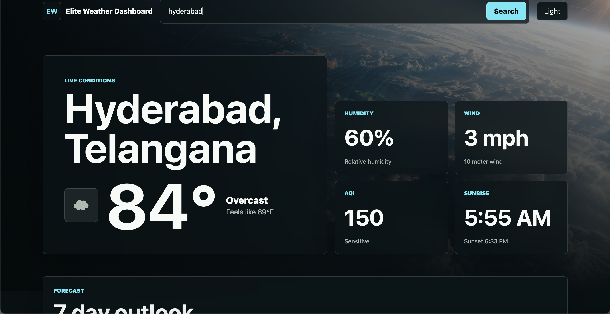

# Elite Weather Dashboard

A premium responsive weather dashboard built with **Vite**, **React**, and modern CSS. It helps users search cities, view live weather updates, AQI insights, sunrise/sunset timing, and switch between dark/light mode.

## Live Demo

[View the live app](https://elite-weather-dashboard.vercel.app)



## Features

* Search weather by city name
* View current temperature instantly
* Check humidity levels
* Track wind speed
* View AQI (Air Quality Index)
* Check sunrise and sunset timing
* Switch between dark and light mode
* Responsive layout for desktop, tablet, and mobile screens
* Polished UI with cards, gradients, and clean spacing
* Fast loading with React + Vite

## Tech Stack

* React
* Vite
* JavaScript
* CSS
* HTML
* Weather API
* Git and GitHub
* Vercel

## How To Run This Project

1. Clone or download this repository.

2. Open Terminal and move into the project folder:

```bash
cd elite-weather-dashboard
```

3. Install the project packages:

```bash
npm install
```

4. Start the development server:

```bash
npm run dev
```

5. Open the local URL that Vite shows in Terminal. It usually looks like:

```text
http://localhost:5173/
```

## What I Learned

* How to integrate APIs in React
* How to fetch real-time weather data
* How to use React state with `useState`
* How to use `useEffect` for API calls
* How to manage loading and error states
* How to build responsive layouts
* How to style dark/light themes
* How to deploy React apps using Vercel
* How to use Git and GitHub professionally

## Project Structure

```text
elite-weather-dashboard/
├── docs/
│   └── app-screenshot.png
├── src/
│   ├── App.jsx
│   ├── main.jsx
│   └── styles.css
├── index.html
├── package.json
├── package-lock.json
├── vite.config.js
└── README.md
```

## Useful Commands

```bash
npm run dev
```

Runs the app while developing.

```bash
npm run build
```

Creates a production build.

```bash
npm run preview
```

Previews the production build locally.

## Author

**Richitha Reddy Meka**
